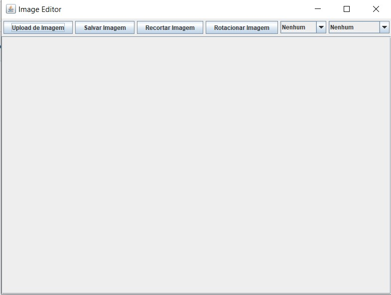
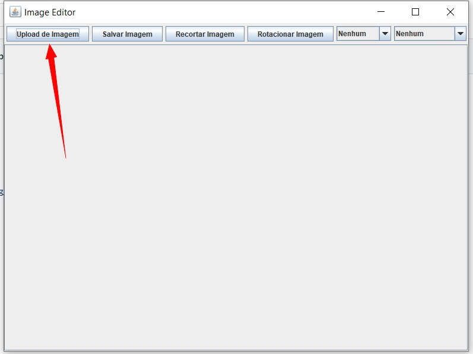
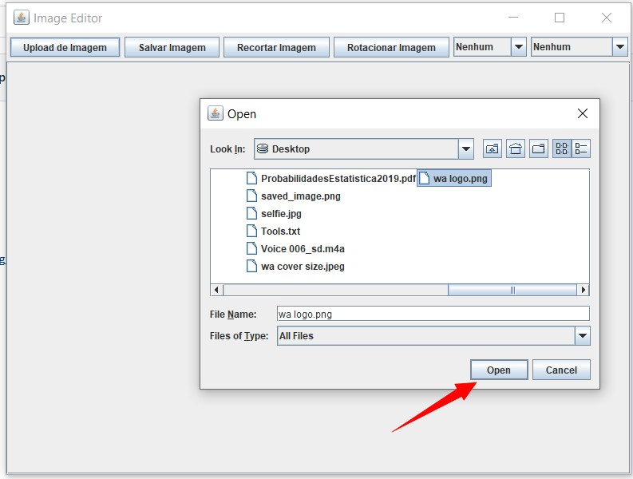
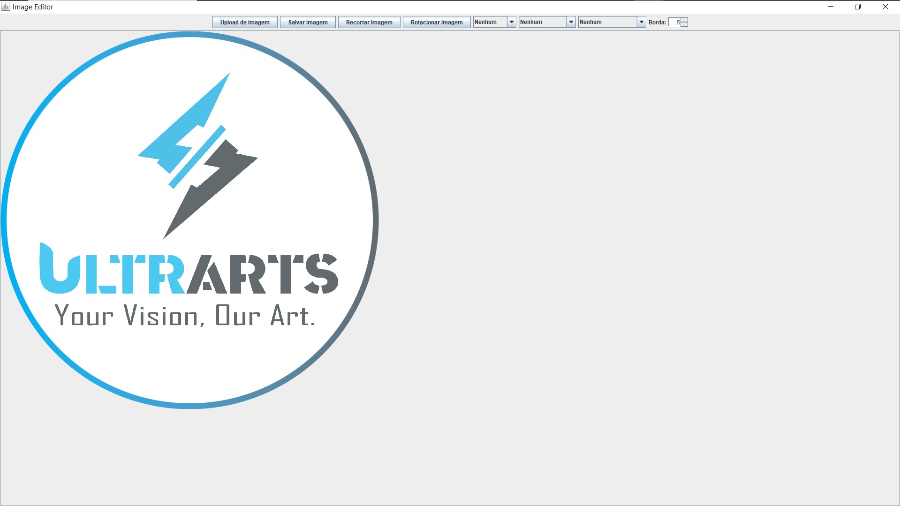
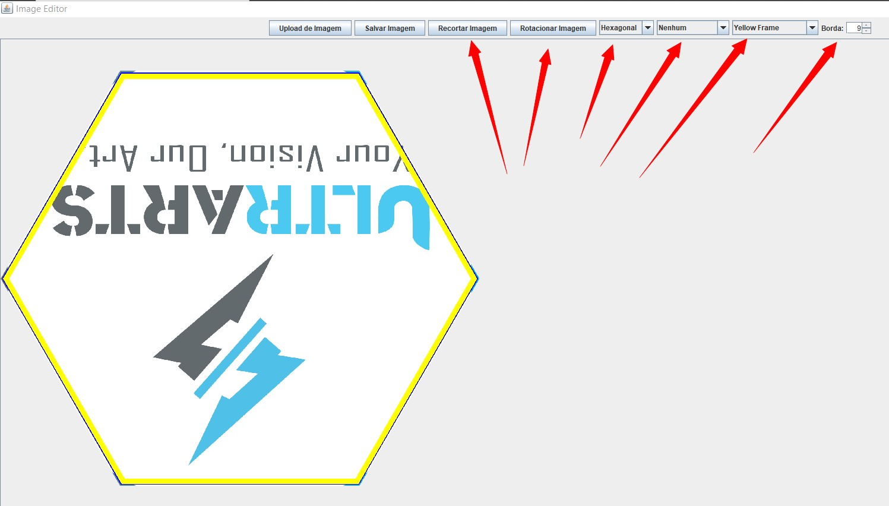
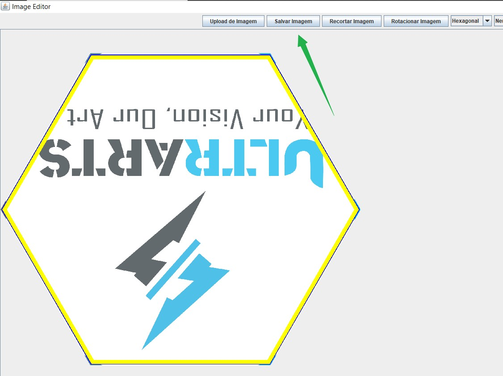

# Image-Editor---Java
Image manipulator software developed in Java
##Steps to use:
- Run the project
  

- Upload the Image
  

- Apply the manipulation You want:
    -  Cut
    -  Rotate
    -  Shappe
    -  Shadow
    -  Frame
    -  Border Size
     
 

- And Save the modified image
  

